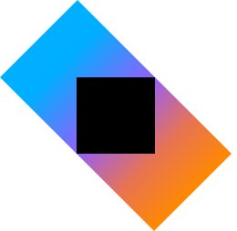

- 👋 Hi, I’m [@alannungaray](./me/index.md)
- 👀 I’m interested in F.I.R.E and Health projects.
- 🌱 I’m  working with Fullstack JS and other misterious languages
- 📫 You can find me on https://www.linkedin.com/in/alannungaraydev/ and [https://alannungaray.com/](https://alannungaray.vercel.app/)

<!---
alannungaray/alannungaray is a ✨ special ✨ repository because its `README.md` (this file) appears on your GitHub profile.
You can click the Preview link to take a look at your changes.
--->

# 💘 Technologies that I love. 

This section represents a live project where I save some valuable knowledge, links and annotations that helps me on my daily work. 

### 🧠 Feature development

### 💅 Styling

### 🚀 Server side rendering

### 💌 API Services

### 💻 General use

 
 
 
 
 
 
 
 
 

### 📃 Databases 

 
 
 
 
 

### 🛠 Tools

 
 
 
 
 
 
 

### ☁ CLOUD

 
 
 
 

